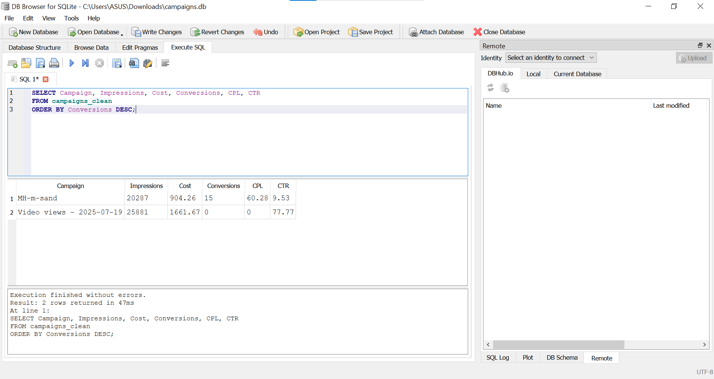
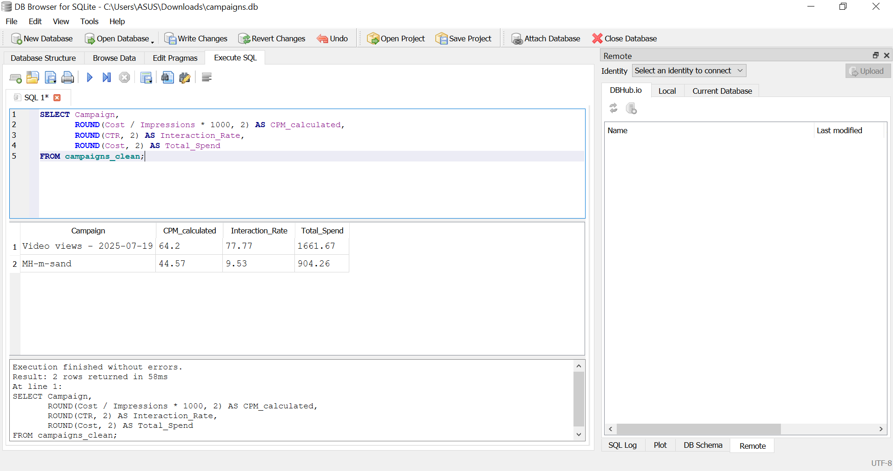
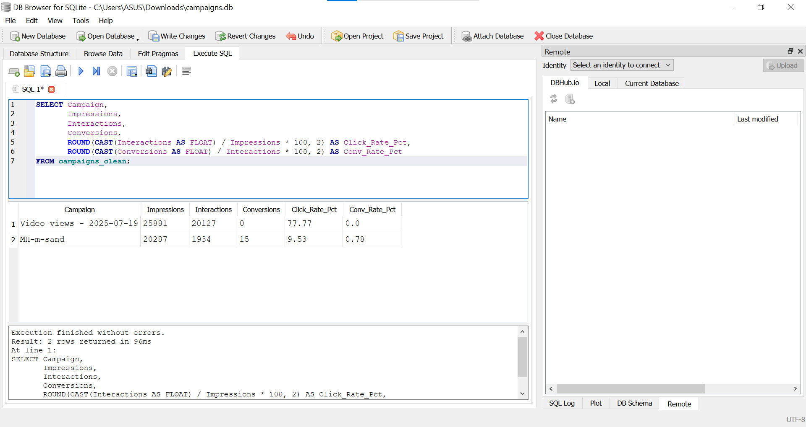
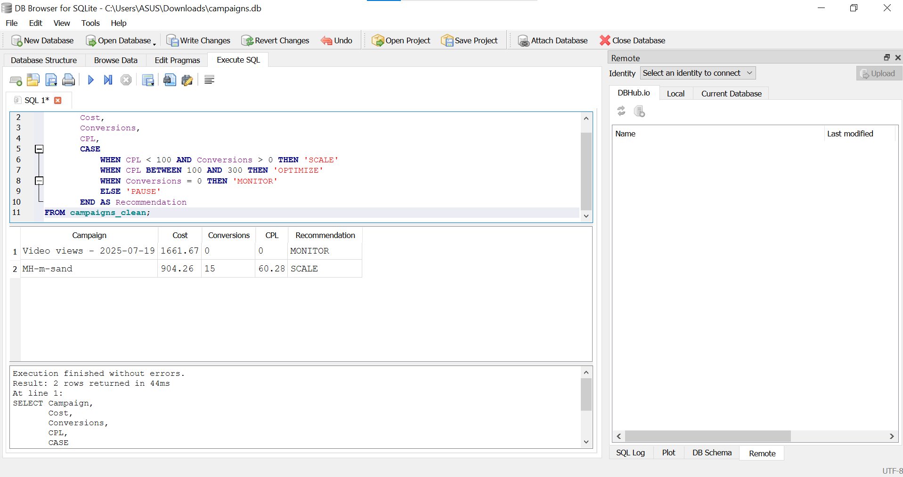
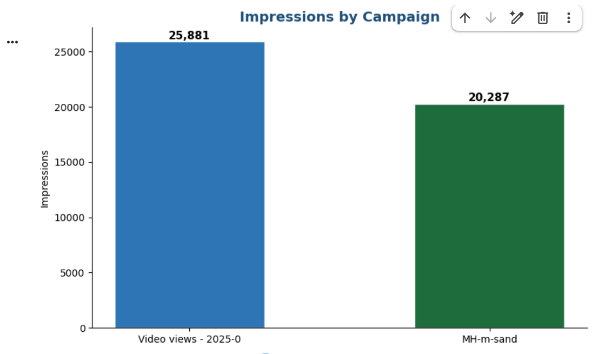
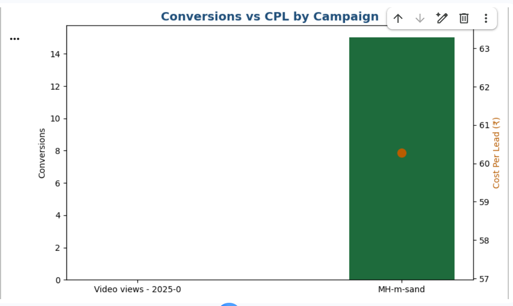
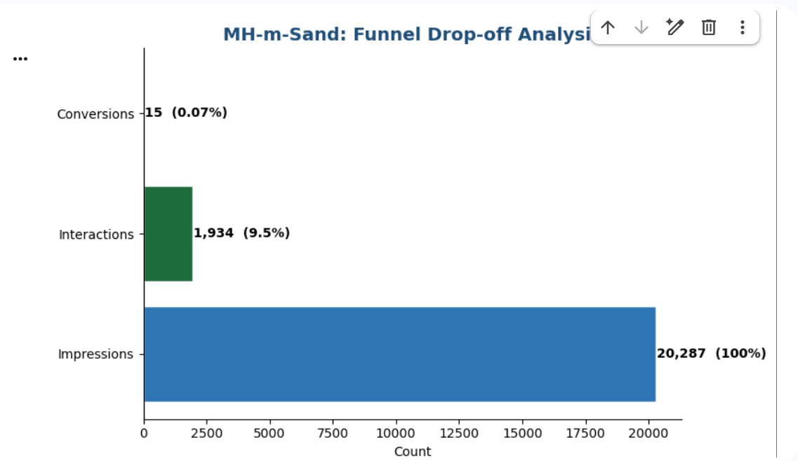
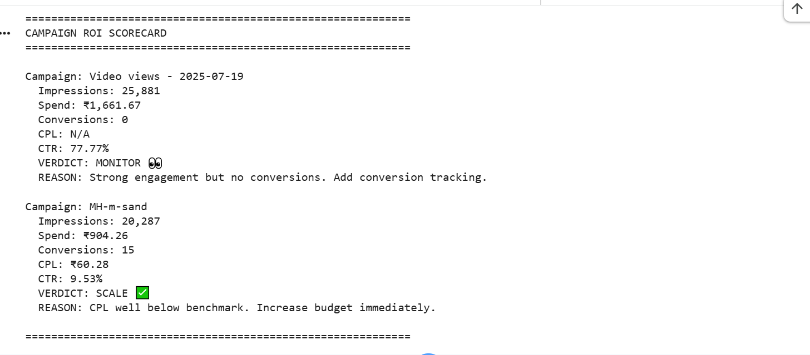
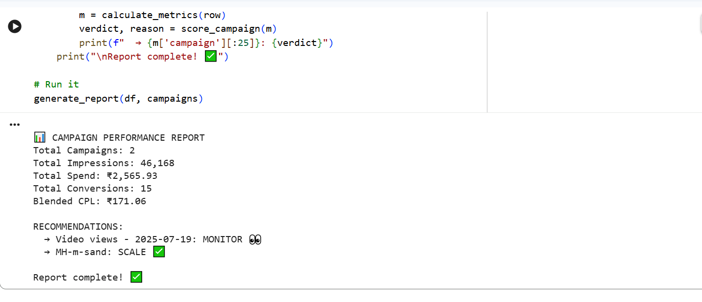

# 📊 Campaign Performance Analyzer
### Real Google Ads Data · Python + SQL · B2B Industrial Marketing

> I manage Google Ads campaigns for a B2B industrial machinery manufacturer in Maharashtra. — . Every month I download a campaign report that looks
> like a mess: numbers with commas, percentages as text, total rows mixed with campaign rows.
> I built this tool to clean that data automatically, run SQL funnel analysis, generate
> visual charts, and output a clear SCALE / MONITOR recommendation for each campaign —
> so I can make budget decisions in minutes instead of hours.

---


This context matters because B2B industrial CPL benchmarks are very different from
e-commerce or SaaS. A good B2B industrial CPL is ₹300–500. Our MH-m-Sand campaign
achieved ₹60.28 — which is extraordinary for this sector.

---

## 📁 The Raw Data Problem (Why This Tool Exists)

When you export campaign data from Google Ads, it looks like this:

- `25,881` — comma inside number, Python treats it as a string
- `77.77%` — percentage symbol, can't do math on it
- Rows 2–4 are "Total: Campaigns", "Total: Account", "Total: Video" — pollute analysis
- 23 columns, most irrelevant — need to extract only what matters
- No CPL benchmark comparison, no funnel drop-off calculation, no SCALE/PAUSE verdict

**This tool solves all of that in one run.**

---

## 📊 Dataset — July 2025 Campaign Data

| Detail | Value |
|--------|-------|
| Company | Indus Crusher |
| Industry | B2B Industrial (Mining & Construction Machinery) |
| Location | Maharashtra → Pan India targeting |
| Period | July 8 – July 31, 2025 (23 days) |
| Raw File | Google Ads CSV (6 rows × 23 columns including totals) |
| Clean Dataset | 2 campaign rows after filtering |
| Total Spend | ₹2,565.93 |
| Total Impressions | 46,168 |
| Total Interactions | 22,061 |
| Total Conversions | 15 qualified leads |
| Blended CPL | ₹171.06 |

---

## 🎯 The Two Campaigns

### Campaign 1: Video Views (2025-07-19)
**Type:** Video | **Budget:** ₹5,000 total | **Goal:** Brand Awareness

Top-of-funnel campaign to get Nakoda Machinery visible to decision-makers
before they enter active buying mode. Not designed to generate leads directly.

| Metric | Value |
|--------|-------|
| Impressions | 25,881 |
| Interactions | 20,127 |
| Interaction Rate | **77.77%** |
| Avg. Cost Per Interaction | ₹0.08 |
| Total Spend | ₹1,661.67 |
| CPM | ₹64.20 |
| Conversions | 0 |
| **Verdict** | **MONITOR 👀** |

### Campaign 2: MH-m-Sand (Lead Generation)
**Type:** Demand Gen | **Budget:** ₹500/day | **Goal:** Qualified leads

Bottom-of-funnel lead gen targeting Maharashtra contractors searching for M-Sand machinery.

| Metric | Value |
|--------|-------|
| Impressions | 20,287 |
| Interactions | 1,934 |
| Interaction Rate | **9.53%** |
| Avg. Cost Per Interaction | ₹0.47 |
| Total Spend | ₹904.26 |
| CPM | ₹44.57 |
| Conversions | **15 leads** |
| CPL | **₹60.28** |
| **Verdict** | **SCALE ✅** |

---

## 🔬 Step 1: Data Cleaning (Python + Pandas)

The `clean_num()` function strips commas and % signs from 8 numeric columns
and filters only the 2 real campaign rows (removes total/summary rows).


**After cleaning — clean numbers ready for analysis:**
```
Campaign       Impressions    Cost  Conversions    CPL    CTR
Video views      25881      1661.67      0.0      0.00  77.77
MH-m-sand        20287       904.26     15.0     60.28   9.53
```

---

## 🗄️ Step 2: SQL Funnel Analysis (DB Browser for SQLite)

### Query 1 — Campaign Summary
```sql
SELECT Campaign, Impressions, Cost, Conversions, CPL, CTR
FROM campaigns_clean
ORDER BY Conversions DESC;
```
MH-m-sand ranks #1 with 15 conversions at ₹60.28 CPL.



---

### Query 2 — Cost Efficiency
```sql
SELECT Campaign,
       ROUND(Cost / Impressions * 1000, 2) AS CPM_calculated,
       ROUND(CTR, 2) AS Interaction_Rate,
       ROUND(Cost, 2) AS Total_Spend
FROM campaigns_clean;
```
MH-m-sand had lower CPM (₹44.57 vs ₹64.20) — more cost-efficient reach.



---

### Query 3 — Funnel Drop-off (Most Important)
```sql
SELECT Campaign, Impressions, Interactions, Conversions,
       ROUND(CAST(Interactions AS FLOAT) / Impressions * 100, 2) AS Click_Rate_Pct,
       ROUND(CAST(Conversions AS FLOAT) / Interactions * 100, 2) AS Conv_Rate_Pct
FROM campaigns_clean;
```

**MH-m-Sand Funnel:**

| Stage | Count | Rate |
|-------|-------|------|
| Impressions | 20,287 | 100% |
| Interactions | 1,934 | 9.53% |
| Conversions | 15 | **0.78%** |

The ad is working (9.53% CTR is strong for B2B industrial).
The landing page is not (0.78% conversion rate = 99 out of 100 clicks are lost).



---

### Query 4 — ROI Scoring
```sql
SELECT Campaign, Cost, Conversions, CPL,
       CASE
           WHEN CPL < 100 AND Conversions > 0 THEN 'SCALE'
           WHEN CPL BETWEEN 100 AND 300 THEN 'OPTIMIZE'
           WHEN Conversions = 0 THEN 'MONITOR'
           ELSE 'PAUSE'
       END AS Recommendation
FROM campaigns_clean;
```
MH-m-sand → SCALE | Video Views → MONITOR



---

## 📈 Step 3: Visualizations

### Impressions by Campaign


### Conversions vs CPL


### MH-m-Sand Funnel Drop-off


---

## 🤖 Step 4: ROI Scorecard + Report





---

## 💡 Business Recommendations Based on This Data

### 1. Scale MH-m-Sand Budget 3x Immediately
**Data:** ₹60.28 CPL · 15 conversions · ₹904 spend in 23 days
**Benchmark:** B2B industrial CPL = ₹300–500. We are 5x better.

Increase daily budget from ₹500 → ₹1,500/day.

| Scenario | Monthly Spend | Expected Leads | Deals (10% close) |
|----------|--------------|----------------|-------------------|
| Current | ₹2,566 | 15 | 1–2 |
| Scaled 3x | ₹45,000 | ~45 | 4–5 |

At ₹5–15 lakh per machinery deal, 4–5 deals = ₹20–75 lakh potential revenue
from ₹45,000 ad spend. This is the highest ROI action available right now.

---

### 2. Fix the Landing Page — 1,919 Leads Are Being Lost
**Data:** 1,934 clicks → 15 conversions = **0.78% conversion rate**

1,919 people clicked the ad and left without filling the form.
At ₹0.47 per click, that is ₹902 in wasted spend every 23 days.

**What to fix:**
- Shorten lead form to 3 fields only: Name · Phone · City
- Add machine photos and specifications on the page
- Replace "Contact Us" CTA with "Get Machine Price in 24 Hours"
- Ensure page loads under 3 seconds on mobile

**Impact:** Improving conversion rate from 0.78% → 2% doubles leads
with zero increase in ad spend.

---

### 3. Retarget the Video Views Audience
**Data:** 20,127 people watched the video. 77.77% interaction rate.

These 20,000 people already know Nakoda Machinery. They are warm.
Currently they are not being followed up anywhere — no retargeting, no lead capture.

**Action:** Create a retargeting campaign targeting people who watched 50%+ of the video.
Show them a lead gen ad with a specific offer: "Request M-Sand Machine Demo"

**Expected CPL from warm retargeting: ₹20–40** vs ₹60 for cold audience.

---

### 4. Add UTM Parameters for Creative-Level Attribution
**Current gap:** We know 15 leads came in but not which specific ad, keyword
or placement drove each conversion.

Add UTM parameters to all destination URLs:
```
?utm_source=google&utm_medium=cpc&utm_campaign=mh-m-sand&utm_content=creative_v1
```
This shows in GA4 exactly which creative drove which lead —
enabling optimization at the ad level, not just campaign level.

---

### 5. Set Conversion Values in Google Ads
**Current state:** Google tracks form fills but doesn't know their value.
Google's bidding algorithm treats a ₹5 lakh machinery lead the same as a newsletter signup.

**Action:** Assign ₹50,000 estimated value per lead in Google Ads conversion settings.
This enables Target ROAS bidding — Google automatically finds leads most likely
to become high-value deals, not just any form fill.

---

## 🛠 Tools Used

| Tool | Purpose |
|------|---------|
| Python (Pandas) | Load CSV, filter rows, clean 8 numeric columns |
| Matplotlib | 3 charts — bar, dual-axis, horizontal funnel |
| SQL (SQLite) | 4 queries — summary, efficiency, funnel, ROI scoring |
| DB Browser for SQLite | Execute SQL on cleaned dataset |
| Google Colab | Cloud development environment |
| GitHub | Portfolio hosting |

---

## 🚀 How to Run

1. Open [Google Colab](https://colab.research.google.com)
2. Upload `Campaign report.csv` to Files panel
3. Open `Campaign_Performance_Analyzer.ipynb`
4. Click `Runtime → Run All`

For SQL: Download [DB Browser](https://sqlitebrowser.org) → Import `campaigns_clean.csv` → Execute queries.

---

## 🔮 Next Projects

- **Project 2:** B2B Marketing Funnel Dashboard — GA4 + SQL + Looker Studio
- **Project 3:** Ad Spend ROI Calculator — CAC, LTV, ROAS, Payback Period

---

## 👤 About

**Vishal Mahendra Motling** — Digital Marketing Executive
Targeting B2B SaaS Performance Marketing roles at LeadSquared · WebEngage · CleverTap · MoEngage

📧 vishalmotling8@gmail.com · 📍 Pune, Maharashtra · Open to Mumbai + Remote

---
